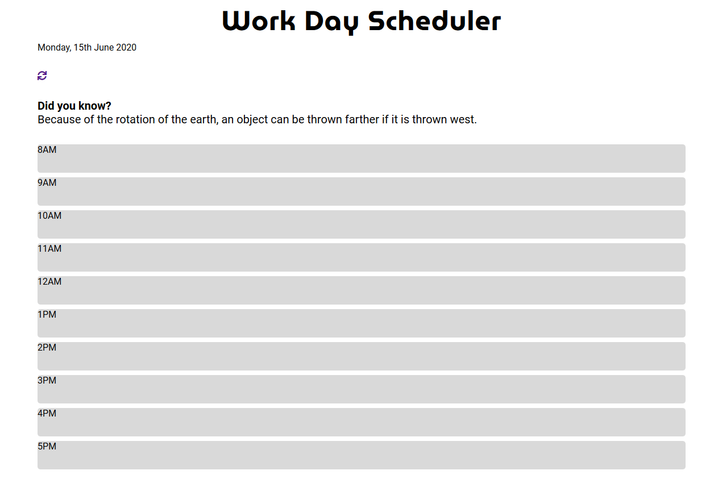

# Work-Day-Scheduler

Daily planner to create a schedule

# Goal
 To create a simple calendar application that allows the user to save events for each hour of the day. This app will runs in the browser and features dynamically updated HTML and CSS powered by jQuery.

# How to use

Click on any block to add items to the schedule, pressing the enter key will append the item to the schedule and save the to local storage.
Clicking on the refresh icon will clear all items from the schedule and local storage

# Deployed Project

https://ldipaola.github.io/Work-Day-Scheduler/